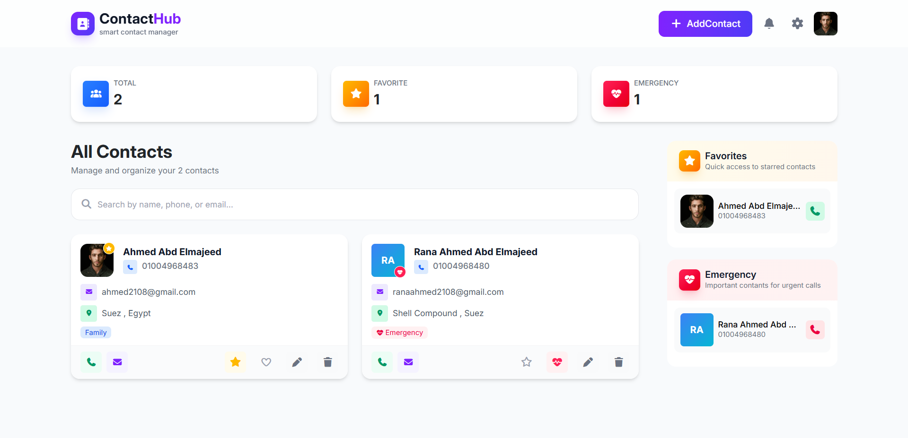
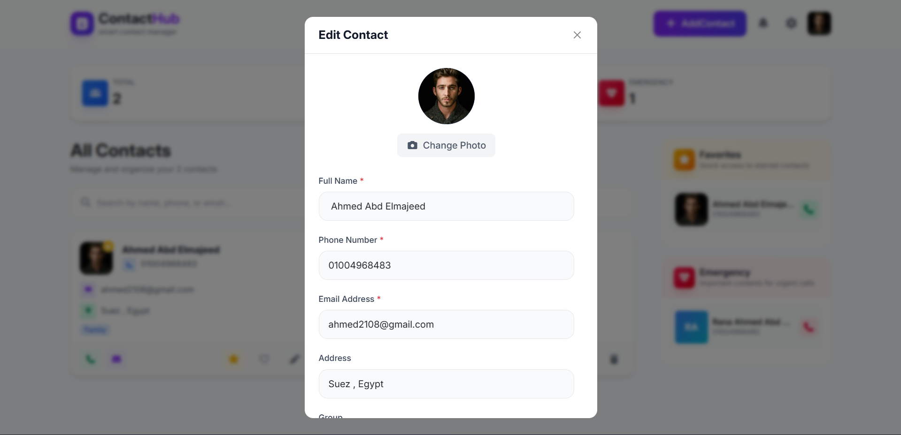

# 📇 ContactHub

ContactHub is a **modern web-based contact management app** that helps you **add, edit, delete, and organize contacts** efficiently. Users can mark contacts as favorites ⭐ or emergencies 🚨, search contacts 🔍, and organize them into groups 🏠👨‍🎓👥💼.

🔗 **Live Demo:** [https://contactshub.netlify.app/](https://contactshub.netlify.app/)  

---

## ✨ Features

- ➕ Add new contacts with **name, phone, email, address, group, avatar, and notes**.  
- ✏️ Edit existing contacts without losing their avatar.  
- ⭐ Mark contacts as **Favorite**.  
- 🚨 Mark contacts as **Emergency**.  
- 🔎 Filter and search contacts by name, phone, or email.  
- 🏷️ Group badges: Family 🏠, Friends 👥, School 👨‍🎓, Work 💼, Other ⚡.  
- 🎨 Random gradient avatar generated if no image is provided.  
- 📱 Fully responsive with **Bootstrap 5**.  
- 💾 Data saved in **LocalStorage**.

---

## 🖼 Screenshot

  

  

  

---

## 🛠 Technologies Used

- **Frontend:** HTML, CSS (Bootstrap 5), JavaScript  
- **Libraries:** SweetAlert2 for alerts 🛎️  
- **Storage:** LocalStorage 💾  

---

## 📬 Contact

**Your Name**
Email: [rannaahmeddd1@gmail.com](mailto:rannaahmeddd1@gmail.com)
GitHub: [https://github.com/RanaAhm3d](https://github.com/RanaAhm3d)
